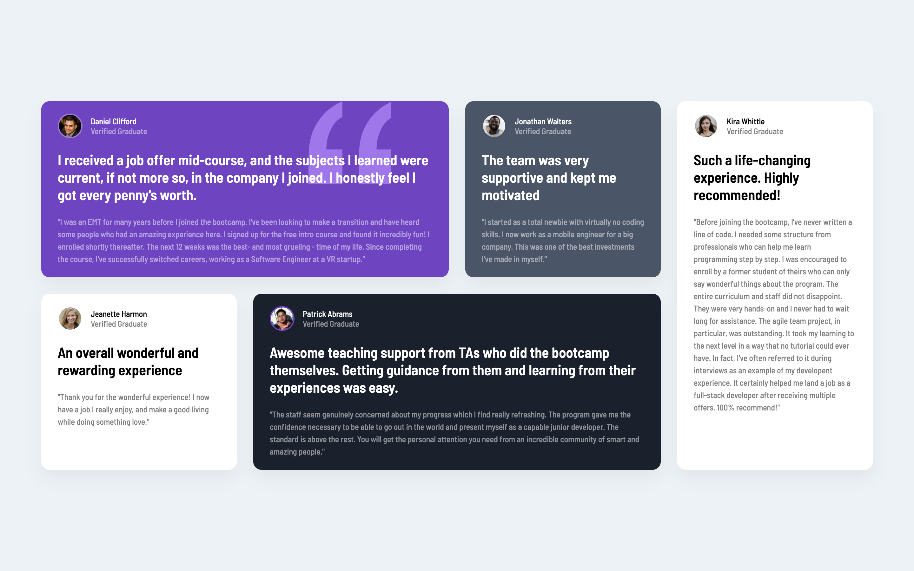

# Frontend Mentor - Testimonials grid section solution

This is a solution to the [Testimonials grid section challenge on Frontend Mentor](https://www.frontendmentor.io/challenges/testimonials-grid-section-Nnw6J7Un7). Frontend Mentor challenges help you improve your coding skills by building realistic projects. 

## Table of contents

- [Overview](#overview)
  - [The challenge](#the-challenge)
  - [Screenshot](#screenshot)
  - [Links](#links)
- [My process](#my-process)
  - [Built with](#built-with)
- [Author](#author)

**Note: Delete this note and update the table of contents based on what sections you keep.**

## Overview

### The challenge

Users should be able to:

- View the optimal layout for the site depending on their device's screen size

### Screenshot

### Links

- Solution URL: [https://github.com/loicmaes/frontendmentor-testimonial-grid](https://github.com/loicmaes/frontendmentor-testimonial-grid)
- Live Site URL: [https://loicmaes.github.io/frontendmentor-testimonial-grid](https://loicmaes.github.io/frontendmentor-testimonial-grid)

## My process

### Built with

- Semantic HTML5 markup
- CSS custom properties
- Flexbox
- CSS Grid
- Sass/SCSS

## Author

- Website - [Loïc MAES](https://www.maesloic.fr/)
- Frontend Mentor - [@loicmaes](https://www.frontendmentor.io/profile/loicmaes)
- Twitter - [@LoicServices](https://www.twitter.com/LoicServices)
- Instagram - [@uiux.loicmaes](https://www.instagram.com/uiux.loicmaes)
- Twitch - [uiuxloicmaes](https://www.twitch.tv/uiuxloicmaes)
